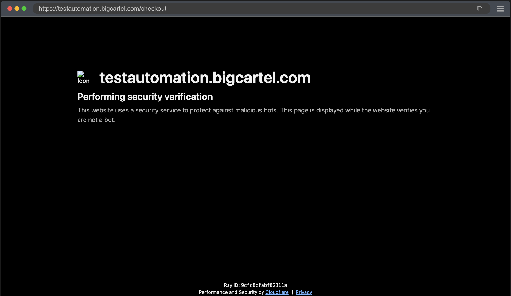

# Playwright POC

> A proof of concept to showcase the implementation of [Playwright](https://playwright.dev/) as a test framework with multiple test reporters *([Monocart](https://github.com/cenfun/monocart-reporter) and [Allure](https://allurereport.org/))* to test the checkout flow and [Apache JMeter](https://jmeter.apache.org/) load test integration to measure performance for the ["Test Automation - Big Cartel E-commerce Test store"](https://testautomation.bigcartel.com/).

---
### Table of contents


- [Overview](#overview)
- [Project information](#project-information)
- [Pre requisites](#pre-requisites)
- [Setup](#setup)
- [Run tests and generate the test run report to view test results](#run-tests-and-generate-the-test-run-report-to-view-the-test-results)
  - [Test run with Playwright HTML report generation](#test-run-with-playwright-html-report-generation)
  - [Test run with Monocart report generation](#test-run-with-monocart-report-generation)
  - [Test run with Allure report generation](#test-run-with-allure-report-generation)
  - [JMeter Load Test Integration to measure performance](#jmeter-load-test-integration-to-measure-performance) 
- [Gotcha's](#gotchas)
- [TODO](#todo)

---


### Overview

This repository demonstrates: 
 - The Playwright Testing Framework to run tests locally. 
 - Test run reporting generated with:
   - [Built-in/Default Playwright HTML reporter](https://playwright.dev/docs/test-reporters)
   - [Monocart reporter](https://github.com/cenfun/monocart-reporter)
   - [Allure reporter](https://allurereport.org/)
 - CI/CD Integration for [GitHub workflow support](https://github.com/badj/playwright-poc/actions) executing tests in [Docker](https://www.docker.com/) with GitHub Actions triggered on push/pull requests to main and for daily scheduled runs:
   - [](https://github.com/badj/playwright-poc/actions/workflows/main.yml)
   - [](https://github.com/badj/playwright-poc/actions/workflows/allure-report.yml)
   >   - The passing workflow for **"Playwright Tests with Allure Report"**  is currently a false positive *(failing issues listed below)*, the workflow has been disabled in GitHub Actions until the issue can be resolved!
   >   - Current Issues: 
   >     - Workflow runs without error in the workspace, generates the artefact, but it doesn't load the report data objects when the index.html is viewed in the downloaded artefact due to a `blocked by CORS policy` issue. 
   >     - Using the allure command line tool to open and serve the report from the downloaded artefact root is failing as well, and will be investigated at a later stage.
   >     - TODO: Will be updated at some stage to use GitHub Pages instead to resolve the issue.
   - [](https://github.com/badj/playwright-poc/actions/workflows/jmeter-load-test.yml)

---
### Project information

> This project repo contains a functional journey test to verify multiple areas of the e-commerce checkout flow

- Search for an item in the store.
- View a product from the search results.
- Select colour and age options from the dropdowns.
- Increase item quantity.
- Proceed to the cart.
- Verify cart details, including:
    - Correct items.
    - Selected options.
    - Quantities.
    - Item prices and cart totals.

---
### Pre-requisites

1. [Node.js](https://nodejs.org/en/download/) (LTS version recommended)
2. [npm](https://docs.npmjs.com/downloading-and-installing-node-js-and-npm/) (Included with Node.js)


---
### Setup

1. Clone or Download
    - Clone this repository: `git clone https://github.com/badj/playwright-poc.git`
    - Alternatively, download the ZIP file and extract it.
2. Navigate to Project Directory:
   ```bash
   cd playwright-poc
   ```
3. Initialise a Node.js project
   ```bash
   npm init -y
   ```
4. Install Playwright
   ```bash
   npm i -D @playwright/test
   ```
5. Install browsers
   ```bash
   npx playwright install
   ``` 

---
### Run tests and generate the test run report to view the test results

#### Test run with Playwright HTML report generation

1. Execute the test
   ```bash
   npx playwright test
   ```
2. OR Execute the test with the UI
   ```bash
   npx playwright test --ui
   ``` 
3. View the HTML report when test execution completes - Command will print to the terminal
   ```bash
   npx playwright show-report
   ```
- A hyperlink to the web server will be printed to the terminal that links through to the generated report - sample output:

  ```
  Serving HTML report at http://localhost:9323. Press Ctrl+C to quit.
  ```

#### Test run with Monocart report generation

1. Execute the test
   ```bash
   npx playwright test
   ```
2. Generate and view the HTML report when test execution completes - The Report opens automatically and is generated in [monocart-report/index.html](monocart-report/index.html)
   ```bash
   npx monocart show-report monocart-report/index.html
   ```
- A hyperlink to the web server will be printed to the terminal that links through to the generated report - sample output:

  ```
  serve dirs [ 'monocart-report', './' ]
  7/8/2025, 10:26:33 PM server listening on http://localhost:8090/index.html
  ```   

#### Test run with Allure report generation

1. Execute the test
   ```bash
   npx playwright test
   ```
2. Generate and view the HTML report when test execution completes - Report will be generated in [allure-report/index.html](allure-report/index.html)
   ```bash
   allure generate allure-results -o allure-report --clean 
   ```
3. OR Generate the report and open it automatically on the web server - Report will be generated in [allure-report/index.html](allure-report/index.html)
   ```bash
   allure generate allure-results -o allure-report --clean && allure open allure-report && echo "file://$(pwd)/allure-report/index.html" 
   ```   
- A hyperlink to the web server will be printed to the terminal that links through to the generated report - sample output:

  ```
  Server started at <http://127.0.0.1:56217>. Press <Ctrl+C> to exit
  ```

#### JMeter load test integration to measure performance

- [A JMeter load tests integration workflow has been integrated to measure site performance](.github/workflows/jmeter-load-test.yml)
- The Jmeter load tests are located in the [performance-tests](performance-tests) directory in [performance-tests/load-test.jmx](performance-tests/load-test.jmx):
> ⚠️ Thread Group configurations were set to low values to reduce the impact of the load test on the e-commerce store where Cloudflare could potentially throttle the requests!
  - Thread Group configurations for the tests:
    - Thread Group number of threads: 3
    - Thread Group ramp time: 10 seconds
    - Thread Group same user on next iteration: true
    - Thread Group on sample error: continue
    - Loop Controller loops: 1
    - Loop Controller continue forever: false
    - ⚠️ Keep thread group configurations set to the original low values to reduce the impact of the load test on the e-commerce store to prevent Cloudflare new request throttling!
- The workflow: 
  - Runs daily at 7:30 AM NZT (cron in UTC: 19:30 previous day). 
  - Installs JMeter. 
  - Executes the JMeter load tests against the ["Test Automation - Big Cartel E-commerce Test store"](https://testautomation.bigcartel.com/) Landing page, Products page and Cart page.
  - Jmeter tests Generate a dashboard (HTML report) and .jtl results. 
  - Uploads artifacts for review (view in GitHub Actions UI). 
  - Prints a summary for quick analysis (e.g., avg response time, error rate).
- ⚠️ Run the JMeter tests locally:
  - [Download and install Java 8+ installed (JMeter requires it) from Oracle Downloads](https://www.oracle.com/java/technologies/downloads/)
  - [Download and install Apache JMeter (latest version) from JMeter Apache](https://jmeter.apache.org/download_jmeter.cgi)
  - Unzip it and run bin/jmeter.bat (Windows) or bin/jmeter (macOS/Linux). 
  - Open the JMeter GUI and load the test plan from [performance-tests/load-test.jmx](performance-tests/load-test.jmx). 
  - ⚠️ Keep thread group configurations set to the original low values to reduce the impact of the load test on the e-commerce store to prevent Cloudflare new request throttling!

---

### Gotcha's

#### 1. Installing Playwright failing due to an unsupported Node.js version

> Installing Playwright using `npm i -D @playwright/test` failing due to an unsupported Node.js version.
> Your current Node.js version is older than the recommended LTS version.
> Playwright requires a more recent version of Node.js. As of Playwright v1.54.1, the minimum supported Node.js version is typically Node.js 16 or higher.

**To resolve the issue:**

1. Update Node.js using nvm (Node Version Manager) - Install Node.js 18 (LTS) or a newer version like 20
```bash
  nvm install 18
```
2. Switch to the new version
```bash
  nvm use 18
```
3. Set it as the default version
```bash
  nvm alias default 18
```
4. Verify the Node.js version - Ensure it’s at least v16 or higher.
```bash
  node -v
```
5. Verify npm version:
```bash
  npm -v
```

**Additional steps if the steps above do not resolve it:**

6. Clear npm Cache and Reinstall Dependencies → The error may be caused by a corrupted npm cache or incomplete dependency installation
> This ensures a clean slate for dependency installation, avoiding issues from cached or corrupted files.
```bash
  npm cache clean --force
```
7. Remove the node_modules directory and package-lock.json → Navigate to the project directory
> Change to the playwright-poc project directory (example for macOS)*:
```bash
  cd [path to your repo]/playwright-poc
```
8. Remove the node_modules directory and package-lock.json file:
```bash
  rm -rf node_modules package-lock.json
```
9. Reinstall dependencies:
```bash
  npm install
```

#### 2. Test Steps disabled due to Cloudflare security check triggered



> Test Case 4: Proceed to checkout.
> Test steps disabled due to Cloudflare security check triggered on checkout payments page load for CI / Docker / GitHub action runs - issue started on 18 February 2026! 

```javascript
// Step added to deal with Cloudflare security check issue - Disable this step for local runs if test step below are enabled!
expect(currentUrl).toContain('checkout'); 
// TODO: Steps disabled due to Cloudflare security check triggered on checkout payments page load for Docker / GitHub action runs - issue started on 18 February 2026!
// expect(currentUrl).toContain('/checkout/');
// await expect(page).toHaveURL(/^https:\/\/testautomation\.bigcartel\.com\/checkout(\/[A-Z0-9]+)?$/);
// await expect(page).toHaveTitle('Payment Gateway Required (402)')
// await expect(checkoutPaymentsNotConfigured).toHaveText('We’re not set up to take payments.');
```

---

### TODO


---
